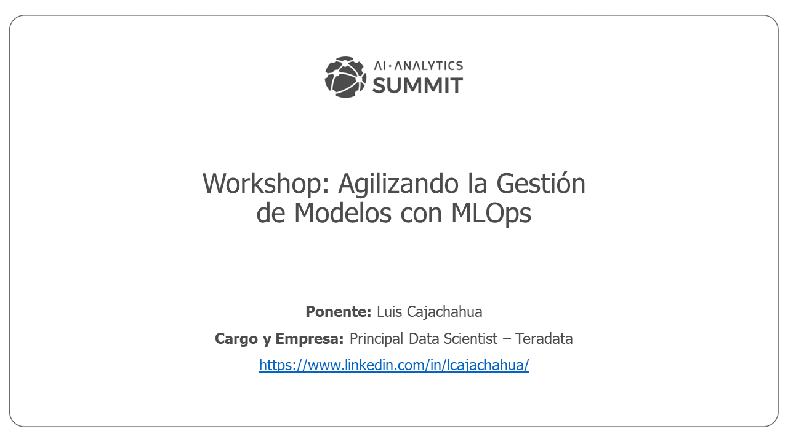

# Workshop AI Summit: Agilizando la Gestión de Modelos con MLOps

Presentación del 21-Oct-2021

Puedes descargar la presentación haciendo clic derecho y eligiendo la opción "Descargar Como.." en este [ENLACE](docs/Workshop_MLOps_AI_Summit.pdf)

Próximamente, DMC pondrá a disposición la [grabación](https://dmc.stringnetlab.com/inicio) en la plataforma del evento:

## Recursos de Aprendizaje:

- [Curso básico de MLOps](https://github.com/graviraja/MLOps-Basics)

- [Colección de Recursos de Aprendizaje](https://github.com/kelvins/awesome-mlops)

- [MLOps.org](https://ml-ops.org/)

- [MLOps Community](https://mlops.community/)

- [MLOps Guide](https://mlops-guide.github.io/)

- [MLOps on Azure](https://github.com/microsoft/MLOps)

- [DeepLearning.ai](https://www.deeplearning.ai/program/machine-learning-engineering-for-production-mlops/)

- [Try JupyterLab](https://jupyter.org/try)

- [Free JupyterLab with Git+R+Python](https://teradata.github.io/jupyterextensions/#/)

## Artículos (No se olviden a la página o canal principal de cada uno para más artículos y videos)

- [The role of MLOps on effective AI](https://medium.com/rappibank/the-role-of-mlops-on-effective-ai-dda75d638805)

- [Blog NVidia: ¿Qué es MLOps?](https://la.blogs.nvidia.com/2020/09/08/que-es-mlops/)

- [Deploy your machine learning pipelines](https://medium.com/@igorzabukovec/deploy-your-machine-learning-pipelines-28007b985202)

- [Best End-to-End MLOps Platforms](https://neptune.ai/blog/end-to-end-mlops-platforms)

- [Automating Advanced AI at Scale](https://assets.teradata.com/resourceCenter/downloads/WhitePapers/Automating-Advanced-AI-at-Scale-MD008530.pdf)

- [Artificial Intelligence and AnalyticOps to Continuously Improve Business Outcomes](https://www.youtube.com/watch?v=9h2ohKvX1gs&ab_channel=DataWorksSummit)

- [Scaling AI like a tech native: The CEO’s role](https://www.mckinsey.com/business-functions/mckinsey-analytics/our-insights/scaling-ai-like-a-tech-native-the-ceos-role)

- [Creating a model validation pipeline](https://blogs.sas.com/content/subconsciousmusings/2020/02/19/modelops3/)

- [Accelerating Data Science to Production with MLOps Best Practices](https://www.youtube.com/watch?v=WYLiPDg0RSI)

- [Introduction to MLOps and Vertex Pipelines](https://www.youtube.com/watch?v=Jrh-QLrVCvM)

- [Machine Learning Operations (MLOps) On Azure](https://k21academy.com/microsoft-azure/dp-100/machine-learning-operations-mlops-on-azure/)

- [MLOps: Continuous delivery and automation pipelines in machine learning](https://cloud.google.com/solutions/machine-learning/mlops-continuous-delivery-and-automation-pipelines-in-machine-learning)

- [Machine Learning Engineering for Production (MLOps) Andrew Ng]()

- [Webinar (AI Tech Talk). Taller MLOps: desplegando servicios en producción](https://www.youtube.com/watch?v=727WIwTTNn8&ab_channel=SpainAI)

- [Gitflow: colaborando en Git](https://medium.com/@ihumai/gitflow-colaborando-en-git-4046f4a95c9c)

- [Designing an open-source cloud-native MLOps pipeline](https://helda.helsinki.fi/bitstream/handle/10138/328526/Makinen_Sasu_Thesis_2021.pdf?sequence=2&isAllowed=y)

## Productos y Proveedores: Ver listado en el enlace de [Colección de Recursos de Aprendizaje](https://github.com/kelvins/awesome-mlops)

